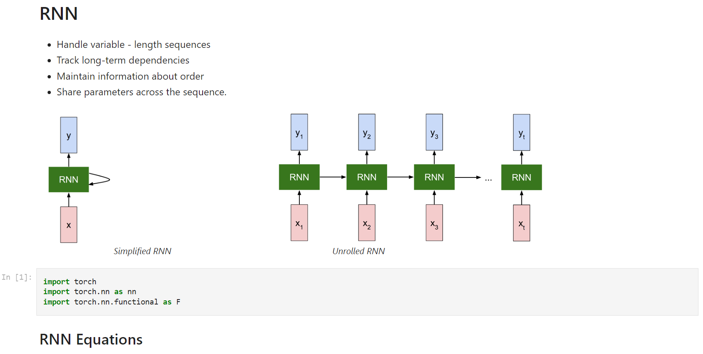
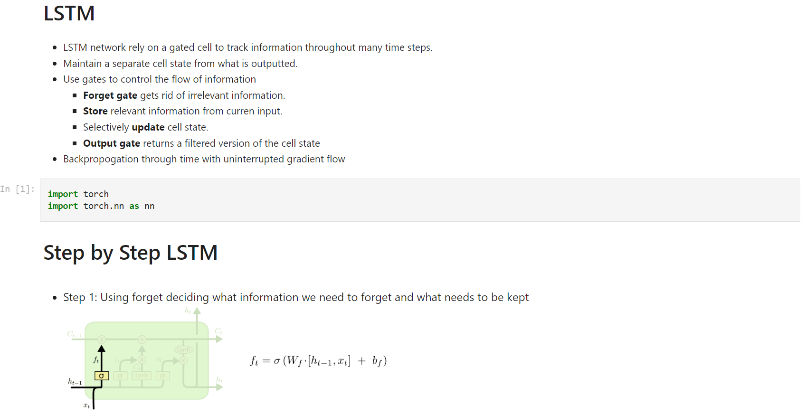
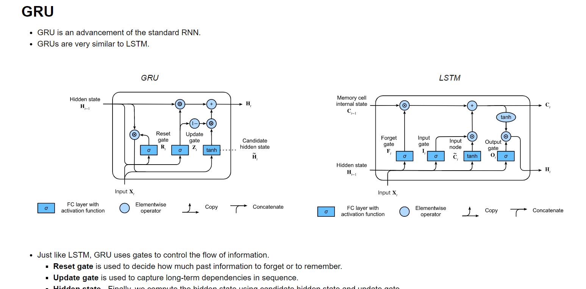

# Sequence-Model
Implementation of Sequence models using Pytorch.
## [Implementation of RNN](http://nbviewer.org/github/mohan-gupta/Sequence-Model/blob/main/RNN%20using%20Pytorch.ipynb)
 

## [Implementation of LSTM](http://nbviewer.org/github/mohan-gupta/Sequence-Model/blob/main/LSTM%20using%20Pytorch.ipynb)
 

## [Implementation of GRU](http://nbviewer.org/github/mohan-gupta/Sequence-Model/blob/main/GRU%20using%20Pytorch.ipynb)
 
